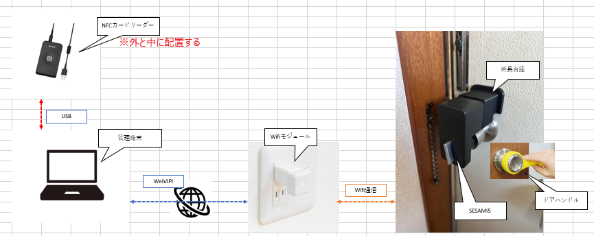

# 本社扉のスマートキ解錠システム 要件定義書

## 1. 概要
本システムは、ICカードを用いて本社扉のスマートキーを解錠する仕組みを提供する。

## 2. 背景・目的
- 物理キーの複製コスト、紛失リスクを削減
- 使用者管理の効率化
- 操作履歴の記録によるセキュリティ向上
- 新人へシステム開発の流れを一通り掴んでもらう
- 今後使用する可能性が高い言語に触れてもらう(Python)
- 開発で使用するTool(Git等)に慣れてもらう

## 3. 機能要件
### 3.1 ICカード登録・管理
- 特定のユーザにのみ操作できるよう制限をかける
- ICカードの登録機能
- 登録されたICカード情報の削除（編集）機能
- 入退場履歴の閲覧機能

### 3.2 解錠機能
- 登録されたICカードによる扉の解錠
- 解錠後一定時間で施錠(設定でOn/Off切替できるものとする)
- 外のICカードリーダでの解錠記録(入場履歴)
- 中のICカードリーダでの解錠記録(退場履歴)

### 3.3 施錠機能
- 登録されたICカードによる扉の施錠

### 3.4 スマートキー監視機能
- 電池残量の監視
- スマートキーのAPI使用履歴の記録（電池残量履歴）
- スマートキー管理者への通知(TRYメーリングリストへ通知？他にいい方法あればそちらでよい。)

### 3.5 その他
- ICカード以外の解錠/施錠方法の検討

## 4. システム構成
### 4.1 ハードウェア
- ICカードリーダー(PaSoRi RC-S300) × 2
- スマートキー(SESAME5)
- 延長台座
- Hub3(スマートキー用の中継器)
- 管理端末(Windows PC)
- ドアハンドル

### 4.2 ソフトウェア
- 解錠/施錠プログラム（Python）
- ICカード管理システム（Python GUIアプリ）

## 5. 運用・管理
- ユーザーマニュアル
 1. ICカードの登録手順
 2. 登録情報の削除（編集）手順
 3. 解錠/施錠手順
 4. 履歴の確認手順

## 6. 参考情報
- SESAME5 製品情報
https://jp.candyhouse.co/products/sesame5?srsltid=AfmBOoqMcqCiwOYN7-iw7z4QtAHpxjTFHrDLfGJw3QniwUNPZgshw4Vf
- SESAME5 API仕様
https://doc.candyhouse.co/ja/SesameAPI
https://github.com/CANDY-HOUSE/API_document
- PaSoRi RC-S300 製品情報
https://www.sony.co.jp/Products/felica/consumer/products/