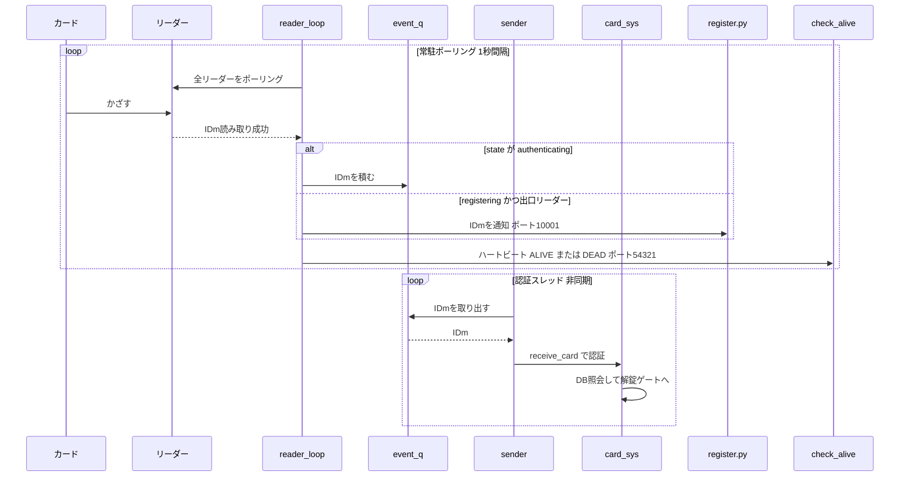

# カード認証バックシステム (reader_daemon)

## 概要

`reader_daemon` は 3 本のスレッドが協調して動く常駐システム。カードリーダーの
ポーリング・認証処理・GUI からの状態変更受付を、それぞれ別スレッドに分離している。
読み取り (`reader_loop`) と認証 (`sender`) の間に `event_q` (キュー) を挟むことで、
認証処理が長引いてもカードのポーリングがブロックされないようにしている。

### スレッド構成

| スレッド | 役割 |
|---|---|
| `reader_loop` | カードリーダーを常時ポーリングし、IDm を読み取って振り分ける本体 |
| `sender` | `event_q` から IDm を取り出し、実際の認証処理へ渡す |
| `receiver` | GUI からの登録/認証モード切り替えを UDP で受信する |

### 通信ポート

| ポート | 向き | 用途 |
|---|---|---|
| 54321 | reader_daemon → `check_alive` | ハートビート (ALIVE / DEAD) |
| 10001 | reader_daemon → `register.py` (GUI) | 登録モード時の IDm 通知 |
| 10000 | GUI → reader_daemon (`receiver`) | 認証/登録モードの切り替え |

---

## フロー図

### 図の読み方

**上のブロック (常駐ポーリング)** … `reader_loop` が 1 秒間隔でリーダーを回し、
IDm を読む。`state` によって振り分けが変わる:

- `authenticating` のとき → IDm を `event_q` に積む (通常の認証)
- `registering` かつ出口リーダー → 認証には流さず `register.py` (GUI) へ通知
  (新規カード登録)

毎周、`check_alive` へハートビート (ALIVE / DEAD) を送り、リーダー台数が
設定数を満たしているかを死活監視側に伝える。

**下のブロック (認証スレッド)** … `sender` が別スレッドで `event_q` から
IDm を取り出し、`card_sys.receive_card` で認証する。ここから DB 照会を経て
解錠ゲート (`request_unlock`) に繋がる。読み取りと認証が非同期に分離されて
いるため、認証が SESAME 通信などで時間がかかってもポーリングは止まらない。

---

## 設計上のポイント

- **読み取りと認証の分離**: `reader_loop` は IDm をキューに積むだけで認証完了を
  待たない。認証は `sender` が別スレッドで処理する。
- **登録モードは認証フローを完全に迂回**: 登録中の IDm は `event_q` に積まれ
  ないため、誤って登録中のカードで解錠が走らない。
- **登録の 45 秒タイムアウト**: GUI 側の状態解除が届かなくても、45 秒で認証
  モードへ自動復帰する (登録モードで固まらないための保険)。
- **死活監視との連携**: 毎周のハートビートを `check_alive` が受信し、途絶えたら
  「システム異常」、DEAD を受けたら「カードリーダー異常」としてメール通知する。
- **停止処理**: `stop()` は `stop_event` を立てて各スレッドを待つ。`receiver` は
  `recvfrom` でブロックしている可能性があるため、自分自身にダミー UDP を
  送って起こしてから join する。

---

> **Mermaid メモ**: participant 名に `Loop` は使えない (予約語 `loop` と衝突する)。
> `RLoop` のように別名にすること。また矢印ラベル内の半角カッコ `()` は環境に
> よって解釈が崩れることがあるため避けている。この図は GitHub / Obsidian /
> VS Code (Mermaid拡張) などでそのまま図としてレンダリングされる。